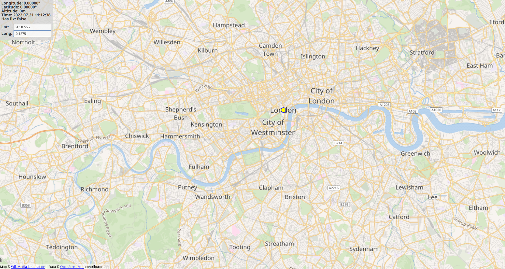

# F9P Coordinates Viewer
A small application written in C++ with Qt and QML to display the coordinates of the F9P GNSS on an interactive map.



## Build
The application targets Qt 5.15 LTS.

### Libraries
To compile the project, you will need the following dependencies:
- [libserial](https://github.com/crayzeewulf/libserial/)
- [lapack](https://netlib.org/lapack/)
- [tbb](https://github.com/oneapi-src/oneTBB)
- [qt5](https://www.qt.io/)
- [qt5-location](https://www.qt.io/)
- [qt5-quickcontrols](https://www.qt.io/)

### Build the release version
Follow [Qt's guide](https://doc.qt.io/qt-5/linux-deployment.html) on how to build the application.
If you have any problem, you may want to check [this useful answer](https://forum.qt.io/topic/98501/static-compile-error-qt5-12-0-bootstrap-private/8) from Qt Forum.

## Use offline tiles
If you want to use the application without an internet connection, you will need to download the tiles on your disk.
To do this, download the most recent version of [JTileDownloader](https://github.com/Zverik/JTileDownloader).
Next, enter the coordinates of the bounding box you want to download, specify the zoom levels and select a folder to store the tiles.
Be sure to download only the tiles you need and please take a look at the [Tile usage policy](https://operations.osmfoundation.org/policies/tiles/) of OpenStreetMap.

Once you have downloaded the tiles, you need to format their names under a specific format required by the application.
To do this, you can use the small [`import_tiles.sh`](import_tiles.sh) script that will do that for you.
Simply enter the following command from the folder of the project:
```bash
./import_tiles.sh /path/to/directory/containing/the/tiles
```
Before, be sure to check that you have the rights to execute the script. If not: `chmod u+x import_tiles.sh`

Next, in QtCreator open the `qml.qrc` file (right-click > Open in Editor). From there, remove any missing files (Remove Missing Files) and select "Add Files".
Select all the tiles imported in the "Offline_tiles" folder and select open.
Now save and build the project.

Next time you will launch the application, it will try to load the tiles from the Offline_tiles folder first.
And if you are not connected to the internet, the application will still be able to display the tiles you have downloaded.

## Credits
The original version of the GNSS driver used in the project comes from [here](https://github.com/lapo5/HAL-Drotek-F9P).
